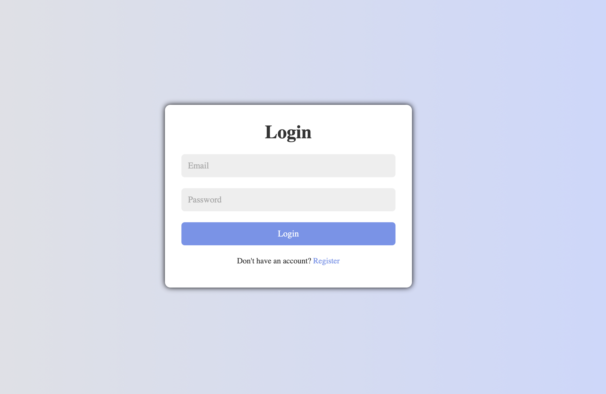
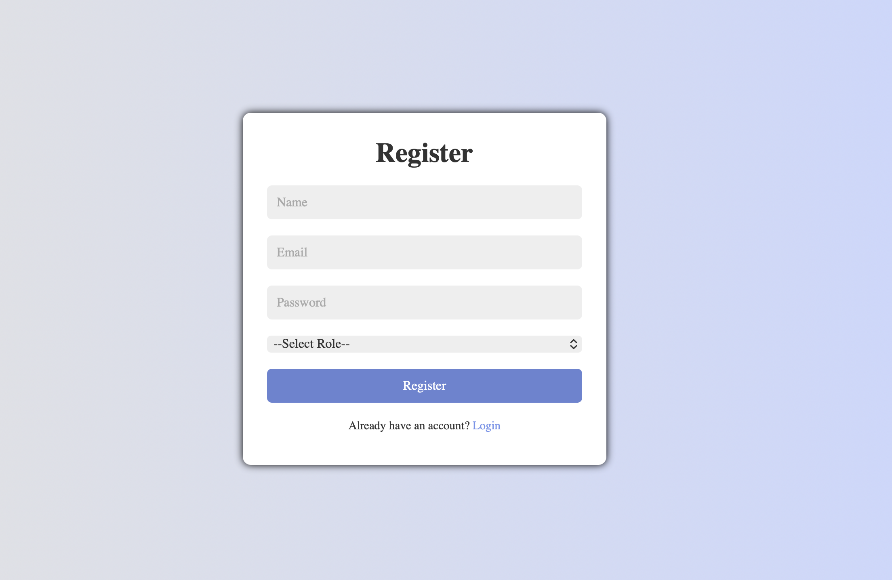
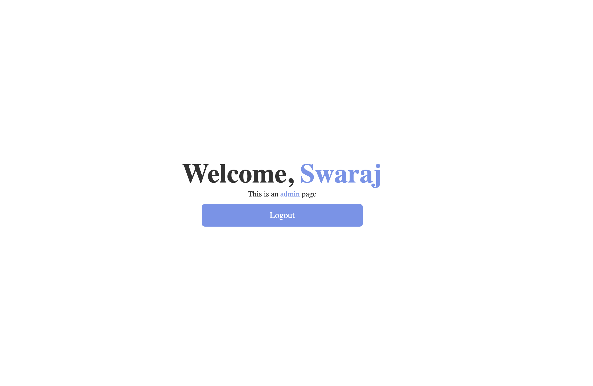

# Login & Registration System using PHP and MySQL

## 📌 Project Overview

A secure Login & Registration System developed using PHP and MySQL with session management and role-based authentication. The system allows users to register, log in, and access dashboards based on their roles (Admin/User).

## 🛠 Technologies Used

* HTML5
* CSS3
* JavaScript
* PHP
* MySQL
* XAMPP Server

## ✨ Features

* User Registration
* User Login Authentication
* Admin Login
* Role-Based Access Control
* Session Management
* Password Security
* Logout Functionality
* Admin Dashboard
* User Dashboard

## 🗄 Database Structure

**Database Name:** `users_db`

**Table Name:** `users`

| Column   | Type              |
| -------- | ----------------- |
| id       | INT (Primary Key) |
| name     | VARCHAR(255)      |
| email    | VARCHAR(255)      |
| password | VARCHAR(255)      |
| role     | VARCHAR(50)       |

## ▶️ How to Run the Project

1. Install XAMPP.
2. Start Apache and MySQL from the XAMPP Control Panel.
3. Create a database named `users_db`.
4. Import the SQL file into phpMyAdmin.
5. Copy the project folder to:

   ```
   C:\xampp\htdocs\
   ```
6. Open your browser and visit:

   ```
   http://localhost/php-login-registration-system
   ```

## 📸 Screenshots

### Login Page



### Registration Page



### Admin Dashboard



### User Dashboard


## 🔐 User Roles

### Admin

* Access Admin Dashboard
* Manage System Features

### User

* Access User Dashboard
* View Personal Information

## 👨‍💻 Author

**Suyash Taral**

B.Tech Student | Web Development Enthusiast

---

⭐ If you found this project useful, consider giving it a star on GitHub.
